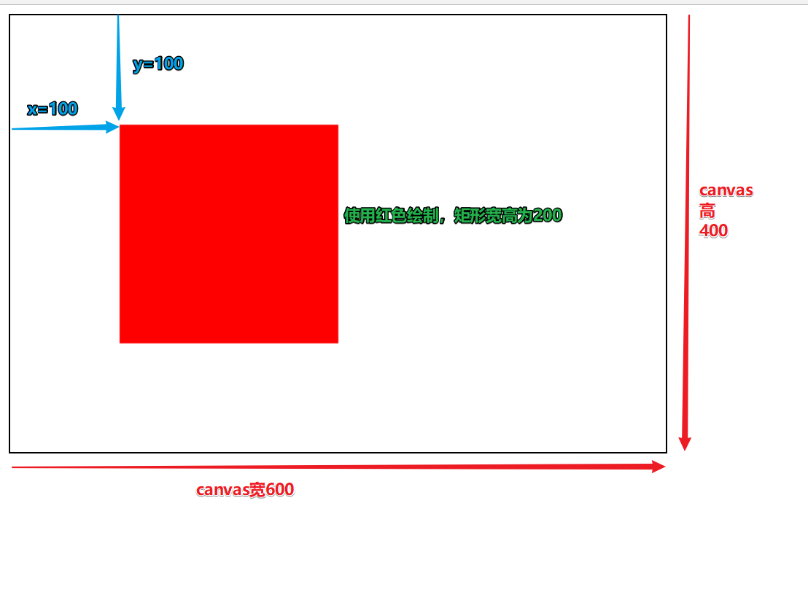
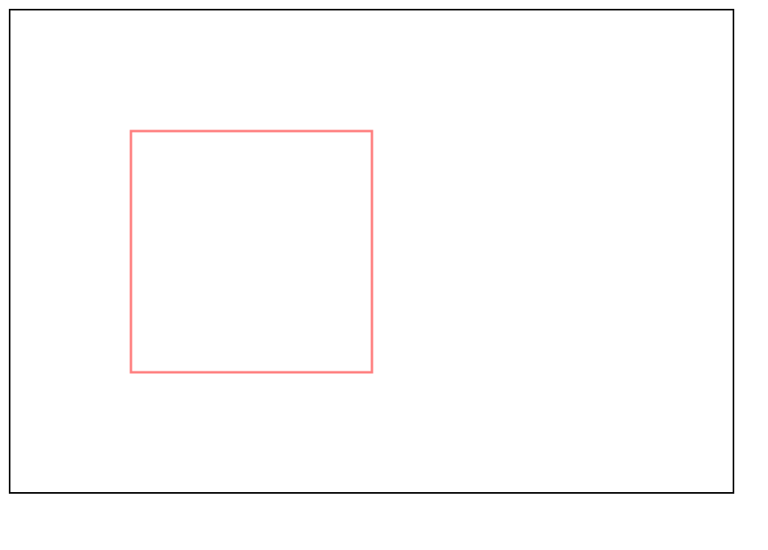
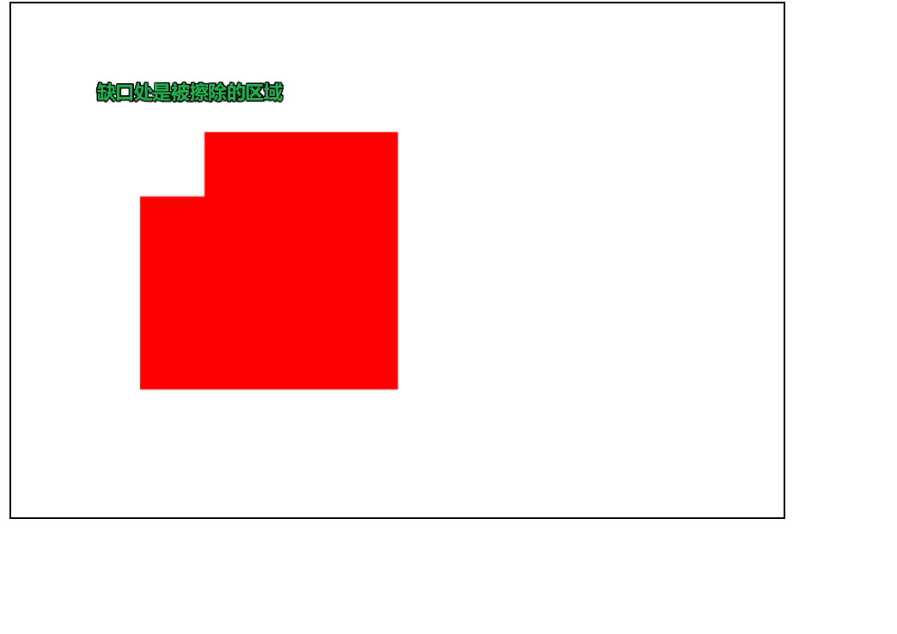
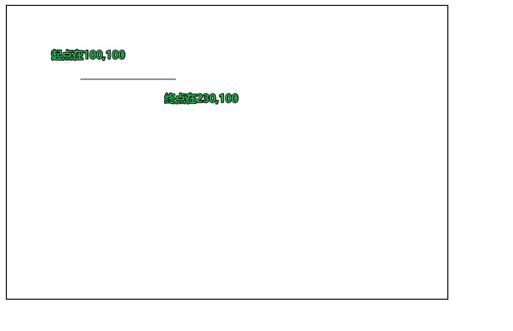
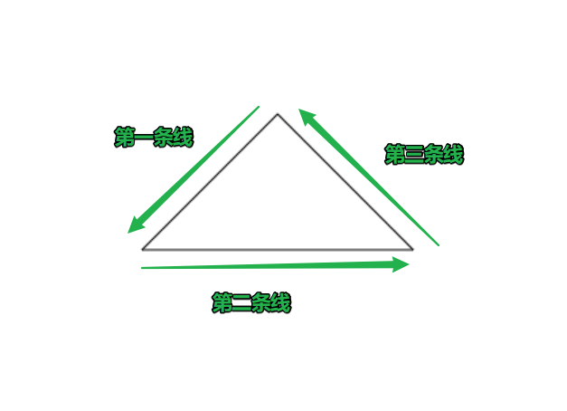
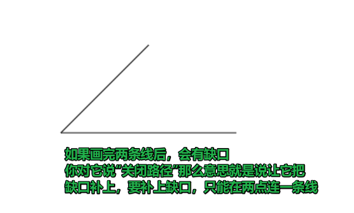

## canvas简介

> canvas是H5中新推出的一款专门用来绘制图形的标签，它相当于是div，只不过div里面是放其他元素，而canvas里面是专门用来绘图的。相当于HTML中的“画板”，使用canvas标签，就相当于在网页中创建出来一块区域专门用来给程序员画画的


### 1. 基础语法：

```html
<canvas id="canvas" width="600" height="400"></canvas>
```

- 解析：这句话就可以让页面出现一个宽600，高400的“画板”，且这个“画板”的id为canvas。但这个画板创建出来后里面没有任何内容。
- 在写宽高时不需要加单位，使用的就是px作为单位

>  **注意**：canvas的宽高只能通过行内属性设置，如果用CSS设置，则会让画板里面的图形大小不正常


### 2. 兼容性：

- canvas在IE8和之前的浏览器不兼容
- 所以写canvas标签时，最好加一段内容

```html
<canvas id="canvas" width="600" height="400">
	您的浏览器版本过低，请下载最新版本！
</canvas>
```

解析：

- 如果支持canvas的浏览器，会解析出一个宽600高400的“画板”区域，而忽略掉双标签之间的内容
- 如果不支持canvas的浏览器，会忽略掉canvas标签，只解析标签内的文字


### 3. 绘制矩形

> 如果只写canvas标签，那么将只会得到一个空空如也的画板，如果要想再画板上有“作品”，需要写JS代码

- 使用三大步：
  - 获取canvas元素
  - 获取绘图上下文（相当于获得画板里的画笔）
  - 绘制图形

#### 3.1 绘制一个填充的矩形

- 代码如下：

```html
<script>
	//1. 获取到canvas
    var canvas = document.getElementById('canvas');

    //2. 获取绘图上下文
    var ctx = canvas.getContext('2d');

    //3. 绘制图形
    //使用红色绘制
    ctx.fillStyle = "#f00";
    //绘制一个矩形，矩形位置在canvas区域x=100，y=100的位置，矩形宽高为200
    ctx.fillRect(100,100,200,200);
</script>
```

- 最终效果如下：



> 注意：
>
> 1. 把绘图上下文理解为画板中用来画画的画笔即可，不用纠结名词为什么要叫“上下文”这么摸不着头脑的词汇。
> 2. getContext('2d');意思是获取一个专门绘制2d图形的画笔，随着后面的学习深入，还可以绘制3d的，但目前学习就用2d图形掌握即可
> 3. 绘制的图形相对于的原点坐标都是canvas的左上角。
> 4. fillRect方法，是用来绘制一个填充的矩形（即用红色填满200宽200高）


#### 3.2 绘制一个描边的矩形

把上述代码中最后两句

```js
    //使用红色绘制
    ctx.fillStyle = "#f00";
    //绘制一个矩形，矩形位置在canvas区域x=100，y=100的位置，矩形宽高为200
    ctx.fillRect(100,100,200,200);
```

修改为：

```js
    //设置描边颜色
    ctx.strokeStyle = "#f00";
    //画一个描边矩形
    ctx.strokeRect(100,100,200,200);
```


效果如下：



总结：

​	strokeStyle：设置描边颜色，

​	strokeRect：绘制一个描边矩形


####3.3 清空一个矩形区域

语法：

```js
上下文.clearRect(x,y,宽，高);
```

说明：会把对应矩形范围内的内容全部“擦掉”

例：

```js
    //1. 获取到canvas
    var canvas = document.getElementById('canvas');

    //2. 获取绘图上下文
    var ctx = canvas.getContext('2d');

    //3. 绘制图形
    //使用红色绘制
    ctx.fillStyle = "#f00";
    //绘制一个矩形，矩形位置在canvas区域x=100，y=100的位置，矩形宽高为200
    ctx.fillRect(100,100,200,200);
	//从x为100，y为100开始，擦掉一个50*50的矩形范围
    ctx.clearRect(100,100,50,50);
```

效果如下：



### 4. 绘制其他图形

- canvas内置所提供的图形绘制，仅仅只有矩形这一种，如果还想绘制出其他图形，必须“一笔一笔”画出来
- 例如：要绘制一条直线，就需要从起点绘制到终点（即：需要两个点来连接成一条线）

#### 4.1 绘制一条直线

语法：

```js
上下文.moveTo(x, y); 起点位置
上下文.lineTo(x,y); 终点位置
上下文.stroke(); 绘制出线条
```


```html
<body>
    <canvas id="canvas" width="600" height="400"></canvas>
    <script>
        //1. 获取到canvas
        var canvas = document.getElementById('canvas');

        //2. 获取绘图上下文
        var ctx = canvas.getContext('2d');

        //3. 绘制图形
        //3.1 设置落笔起点
        ctx.moveTo(100, 100);
        //3.2 设置直线终点
        ctx.lineTo(230, 100);
        //3.3 描绘出线条（描边）
        ctx.stroke();

    </script>
</body>
```

效果如下：



#### 4.2 绘制三角形

> 绘制三角形，其实就是绘制出三条线段



代码如下：

```html
<body>
    <canvas id="canvas" width="600" height="400"></canvas>
    <script>
        //1. 获取到canvas
        var canvas = document.getElementById('canvas');

        //2. 获取绘图上下文
        var ctx = canvas.getContext('2d');

        //3. 绘制图形
        //3.1 设置落笔起点
        ctx.moveTo(300, 100);
        //3.2 设置第一条线终点
        ctx.lineTo(200, 200);
        //3.3 设置第二条线终点
        ctx.lineTo(400,200);
        //3.4 设置第三条线终点（回到起点）
        ctx.lineTo(300,100);
        //3.5 描绘出线条
        ctx.stroke();

    </script>
</body>
```

> 说明：前一条线的终点，会默认成为下一条线的起点

- 也可以画完两条线后使用“关闭路径”完成三角形绘制

语法：

```js
上下文.closePath();
```


```html
<body>
    <canvas id="canvas" width="600" height="400"></canvas>
    <script>
        //1. 获取到canvas
        var canvas = document.getElementById('canvas');

        //2. 获取绘图上下文
        var ctx = canvas.getContext('2d');

        //3. 绘制图形
        //3.1 设置落笔起点
        ctx.moveTo(300, 100);
        //3.2 设置第一条线终点
        ctx.lineTo(200, 200);
        //3.3 设置第二条线终点
        ctx.lineTo(400,200);
        //3.4 关闭路径
        ctx.closePath();
        //3.5 描绘出线条
        ctx.stroke();
    </script>
</body>
```

